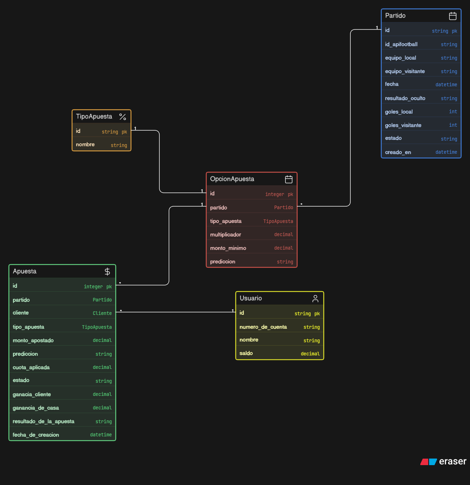
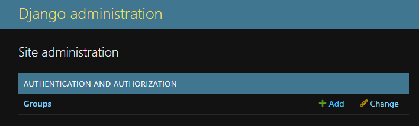
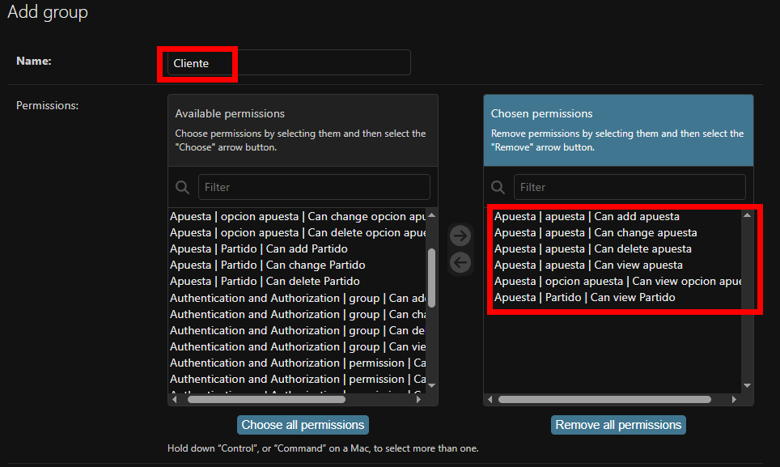
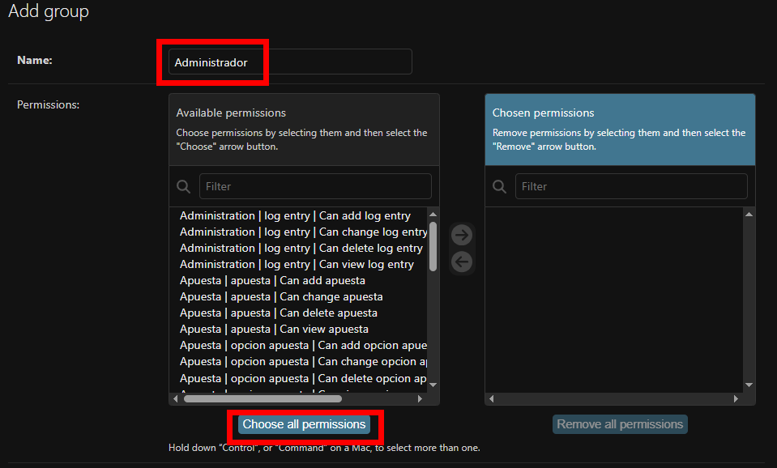

#  API Apuestas Deportivas
Proyecto de laboratorio desarrollado para la materia _Desarrollo de API's_ de la Universidad Nacional de Catamarca (UNCa)

## Descripción:
API REST de simulación apuestas deportivas centrado en la liga Argentina de fútbol
desarrollada en Django REST Framework que le permite a los usuarios realizar apuestas y controlar sus ganancias
una vez finalizado el evento deportivo. Apoyandonos del servicio _API-FOOTBALL_ en su versión gratuita.

## Objetivos Específicos:
- Gestionar usuarios y autenticación.
- Permitir la consulta de partidos disponibles para apuestas.
- Permitir la creación y administración de opciones de apuesta.
- Registrar apuestas realizadas por los usuarios.
- Resolver automáticamente las apuestas una vez finalizado un partido.
- Gestionar saldos de usuarios.
- Proveer mecanismos de autorización mediante roles y permisos.
- Consultar ganancias de la casa de apuestas

##  Tecnologías:
- Python 3.12+
- Django.
- Django REST Framework.
- JWT Authentication.
- SQLite.
- Postman para pruebas.
- Swagger/Redoc para documentación.

## Variables de entorno:
```bash
API_FOOTBALL_KEY = "ApiKey proporcionada por API-FOOTBALL"

#Formato de la fecha y hora: año-mes-diaThora:min:sec Ejemplo:2023-05-30T20:00:00
FECHA_HORA_SIMULADA = 2023-04-01T21:30:00
```

## Instalación:
1. Clonar el repositorio
```bash
    git clone https://github.com/gonzaloaibar/API_Apuestas_Deportivas.git
```
2. Instalar dependencias
```bash
    pip install -r requirements.txt
```
3. Configurar variables de entorno
```bash
    cp .env.example .env
    # Editá el .env con tus valores :)
```
4. Aplicar migraciones
```bash
    python manage.py migrate
```
5. Correr el servidor
```bash
    python manage.py runserver
```
## Modelos principales:
## Partido(``Partido``)
- api_football_id: ID del partido proporcionado por el servicio externo
- equipo_local: equipo local
- equipo_visitante: equipo visitante
- goles_local: cantidad de goles del local
- goles_visitante: cantidad de goles del visitante
- resultado_partido: ["L", "Gana Local"] ["E", "Empate"] ["V", "Gana Visitante"] ["C", "El partido se canceló por algún motivo externo"]  
- estado: pendiente/finalizado (pendiente por defecto)
- fecha = fecha en que se disputa el partido
## Opcion de Apuesta(``OpcionApuesta``)
- partido: partido al que pertenece la opcion disponible para apostar
- tipo_apuesta: valor de las posibles apuestas (Goles/Resultado)
- prediccion: Predicción del usuario ["L", "Gana Local"] ["E", "Empate"] ["V", "Gana Visitante"] ["mas_1_gol", "Más de 1 gol"] ["mas_3_goles", "Más de 3 goles"] ["mas_5_goles", "Más de 5 goles"]
- multiplicador: cuota por la cual se va multiplicar la apuesta del cliente
- monto_minimo:  cantidad minima de dinero admitible para una apuesta
## Apuesta(``Apuesta``)
- apostado_por: Usuario
- opcion_apuesta: 
- monto_apostado: dinero que se quiere apostar 
- estado: pendiente/ganada/perdida (pendiente por defecto)
- ganancia_cliente: premio que recibira el usuario
- ganancia_casa: porcentaje que se lleva la casa de apuestas
- fecha: fecha en la que se realizo la apuesta



## EndPoints:

### Autenticación
- `POST /api/token/` — Obtener JWT (access + refresh token).

### Usuarios
- `POST /usuario/crear_usuario/` — Registrar un nuevo usuario.
- `GET /usuario/ver_usuarios/` — Listado de usuarios.
- `POST /usuario/{id}/cargar_saldo/` — Cargar saldo a un usuario.

### Partidos
- `GET /api/partidos/` — Listado de todos los partidos.
- `GET /api/partidos/{uuid}/` — Ver detalle de un partido.
- `POST /api/partidos/importar_partidos/` — Importar partidos desde la API externa (requiere rango de fechas).
- `POST /api/partidos/terminar_partidos/` — Finalizar partidos y resolver apuestas automáticamente.

### Opciones de Apuesta
- `GET /api/opcion_de_apuestas/` — Listado de opciones de apuesta disponibles.
- `POST /api/opcion_de_apuestas/` — Crear una nueva opción de apuesta.
- `DELETE /api/opcion_de_apuestas/{id}/` — Eliminar una opción de apuesta.

### Apuestas
- `GET /api/apuestas/` — Listado de apuestas del usuario autenticado.
- `POST /api/apuestas/` — Crear una nueva apuesta.
- `DELETE /api/apuestas/{id}/eliminar_apuesta/` — Eliminar una apuesta en estado pendiente.

## Consideración:
En el admin de Django se debera crear dos grupos uno Cliente y el otro Administrador.
Donde el Administrador tendra todos los permisos mientras que el Cliente se le deben agregar todos los permisos
para Apuestas (CRUD) y hacer _GET_ en los endpoints ``api/partidos/ver_partidos`` y  ``api/opcion_de_apuetas/``


